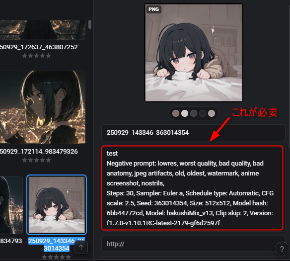
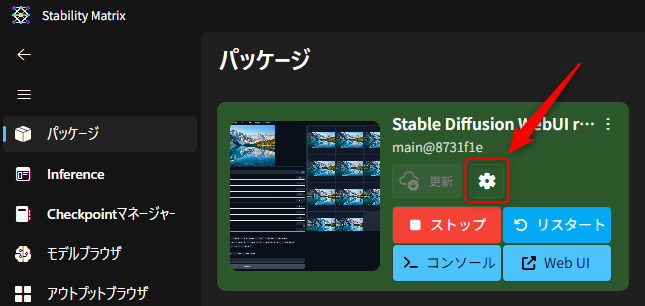
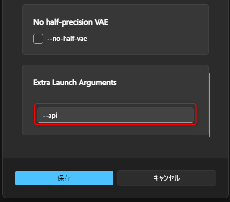
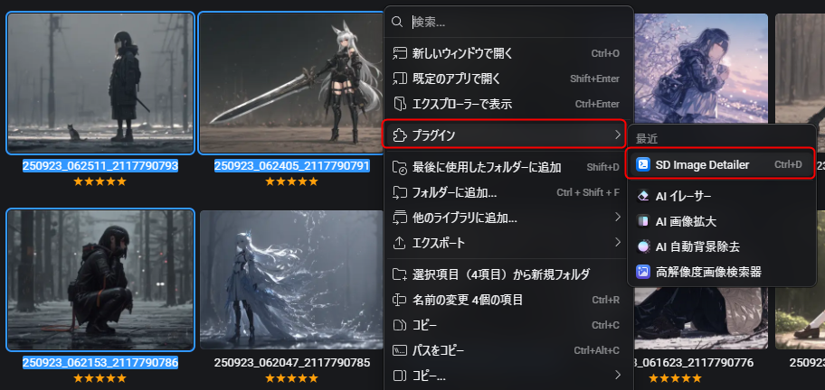
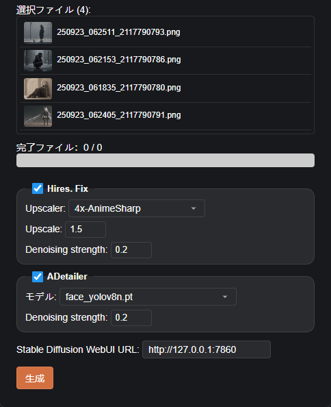

# Eagle SD Image Detailer
Eagle で選択した複数の画像を、 Hires fix/ADetailer を有効にしてまとめて生成するプラグイン

## 前提
[sdweb-eagle-pnginfo](https://github.com/bbc-mc/sdweb-eagle-pnginfo) で Eagle に自動登録された画像のみ利用出来ます。

※この拡張機能で付与されたメタデータから生成情報を取得するため。

※sdweb-eagle-pnginfo の設定で、 `Save Generation info as Annotation` を有効にしておく必要があります。

## 事前準備
Stable Diffusion WebUI を API を呼びせる状態で起動しておきます。
 （起動オプションに `--api` を指定して起動すればOK）

Stability Matrix の場合は以下の部分で指定出来ます。

<table>
  <tr>
    <td></td>
    <td></td>
  </tr>
</table>

## インストール手順
SD Image Detailer.eagleplugin を実行

## 使用方法
Eagle で Hires fix/ADetailer をかけたい画像を任意の枚数選択します。

選択した画像を右クリックし、プラグイン → SD Image Detailer の順に選択します。
 （ショートカットキーも登録可能）

 

ウィンドウが開くので、Hires fix/ADetailer のパラメータを指定します。

初回のみ、 Stable Diffusion WebUI URL 欄に Stable Diffusion WebUI のURLを入力します。
 （デフォルト値と異なる場合のみ）

その後、生成ボタンを押すと Stable Diffusion で画像生成が始まります。

※生成された画像は、プラグイン側の処理ではEagleに自動で登録しません。
 　sdweb-eagle-pnginfo の自動登録が設定されていれば、そちらで自動登録してくれます。
